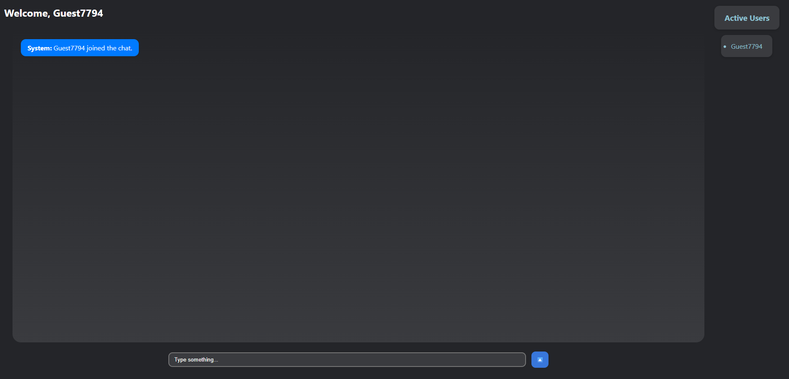
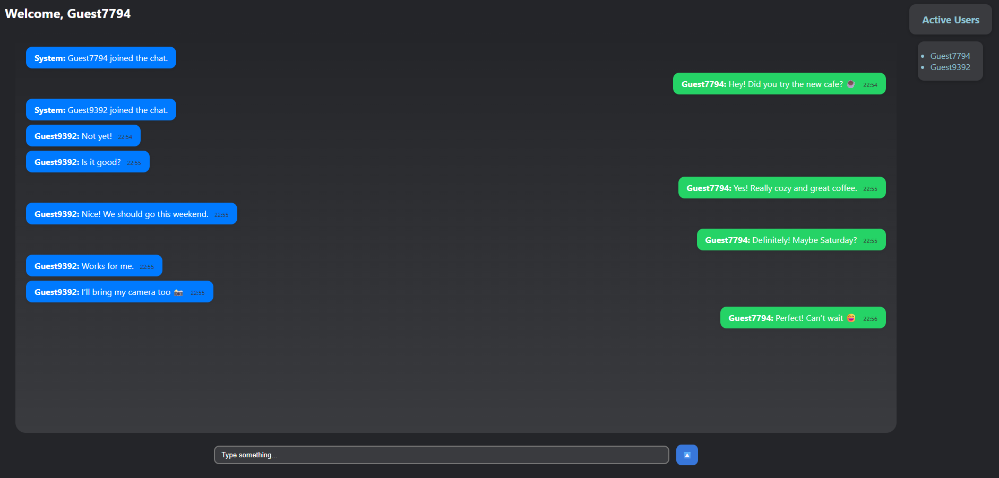

# 💬 Real-Time Chat Application  


A simple **real-time chat application** built with **Flask** and **Socket.IO**.  
It allows multiple users to join instantly, chat in real-time, and view the list of active users.  

<br>

---

## 🚀 Features  
- Real-time communication with **Flask-SocketIO**  
- Auto-generated guest usernames  
- Dynamic active users list  
- Message timestamps  
- Enter key support for sending messages  
- Clean, modern, and responsive UI  

<br>

---

## 🛠️ Tech Stack  
- **Backend**: Flask, Flask-SocketIO  
- **Frontend**: HTML, CSS, JavaScript  

<br>

---

## 📂 Project Structure  
``` text
├── app.py # Backend Flask server
├── templates/
│ └── index.html # Chat UI
├── static/
│ └── style.css # App styling
```

<br>

---

## 🚀 Installation


```bash
# Clone repository
git clone https://github.com/your-username/real-time-chat-app.git 
  
# Install dependencies
pip install -r requirements.txt

# Run application
python app.py

The app will start on http://127.0.0.1:8050.
```

<br>

---

## 🌐 Live Demo  

You can try the app here:  
👉 [Real-Time Chat App on Render](https://realtime-chat-app-9pis.onrender.com)  

⚠️ **Note:** This is hosted on **Render’s free tier**, so the app is very slow or rarely works.  

<br>

---






